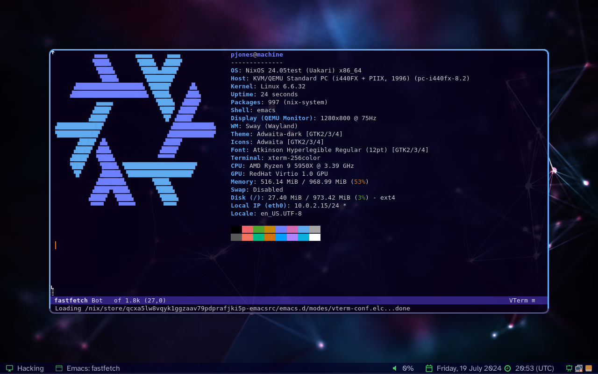

# Peter's Wayland Configuration

<p align="center">
  
</p>

## Reproducible Configuration

Thanks to [Nix][], [nixpkgs][], and [home-manager][] this repository
can reproduce a working Wayland desktop environment exactly as
configured without having to tweak files by hand or in GUI settings
tools.

The screenshot above was taken automatically by a non-interactive test
running in an ephemeral virtual machine (`nix flake check`).

## Details

  * Compositor: [SwayFX][]

  * Status Bar: [waybar][]

  * Notifications: [Sway Notification Center][swaync]

  * Screen Lock: [swayidle][] and [swaylock][]

  * Wallpaper Daemon: [wpaperd][]

## Try It Out

If you have [Nix][] installed and configured with flake support you
can run my configuration in a virtual machine:

```sh
nix run github:pjones/superkey
```

Log in as `pjones` with "`password`" as the password.  Use the key
binding `Super+Space` to start `rofi`.  Other key bindings can be
found in `home/sway/keys.nix`.

This virtual machine is pretty bare-bones.  If you want to start a
virtual machine with this configuration plus my entire workstation
configuration then take a look at my [tilde][] project.

[nix]: https://nixos.org/
[nixpkgs]: https://github.com/NixOS/nixpkgs
[home-manager]: https://github.com/rycee/home-manager
[swayfx]: https://github.com/WillPower3309/swayfx
[waybar]: https://github.com/Alexays/Waybar
[swaync]: https://github.com/ErikReider/SwayNotificationCenter
[swayidle]: https://github.com/swaywm/swayidle
[swaylock]: https://github.com/swaywm/swaylock
[wpaperd]: https://github.com/danyspin97/wpaperd
[tilde]: https://github.com/pjones/tilde
